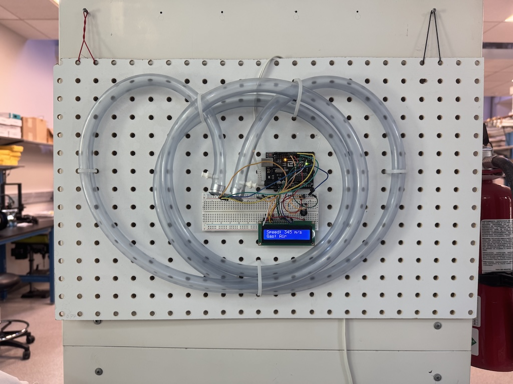

# Identifing a gas by measuring the speed of sound in the gas using an inexpensive ultrasonic distance sensor

In hospitals, patient injuries and deaths have been caused by incorrectly connected medical gas lines (for example, a carbon dioxide tank accidentially connected to a line that should contain oxygen).  Chemical sensors exist that can distinguish differet gases, but often these sensors are expensive which limits their widespread use.

This device measures the speed of sound in a gas; since sound waves travel at different speeds in different gases, this speed measurement can be used to identify a gas.  We do this using an inexpensive HC-SR04 ultrasonic sensor, which is normally used to measure distances: like a bat, the sensor emits an ultrasonic "ping" that bounces off an object and is reflected back to the sensor, and by measuring how much time passes before the reflected sound is detected, the distance from the sensor to the object can be calculated.

In our device, the sound wave is confined inside a segment of tubing with a known length.  By measuring how much time it takes for the ultrasonic "ping" to travel the length of the tubing, we can calculate the speed of sound in the gas inside the tubing.  Finally, the device compares the measured speed to a table containing the speed of sound in various gases, and the gas with the closest match is reported on the LCD screen.  Currently, this device can distinguish five different gases that are commonly used in medical facilities:  air, carbon dioxide, nitrogen, nitrous oxide, and oxygen.
